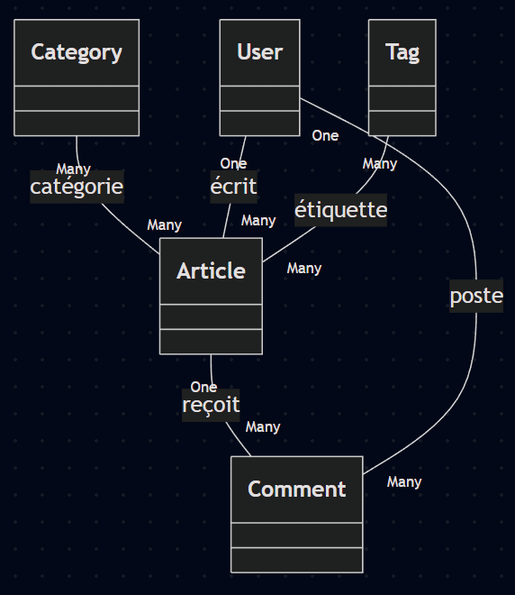

# caddy-sym-74-lts

## Partie 2 Utilisation de Symfony avec Docker

## Menu
- [Partie 1](README.md)
- [Travaillons dans Symfony](#travaillons-dans-symfony)
- [Voir les urls disponibles](#voir-les-urls-disponibles)
  - [Exécutons un composer update](#exécutons-un-composer-update)
  - [Vérifions les exigences de Symfony](#vérifions-les-exigences-de-symfony)
- [Installons PHP CS Fixer](#installons-php-cs-fixer)
- [Créons un contrôleur](#créons-un-contrôleur)
  - [Modifions le test](#modifions-le-test)
  - [Exécutons les tests](#exécutons-les-tests)
- [Vue d'ensemble des entités et relations](#vue-densemble-des-entités-et-relations)
- [Créons une entité Article](#créons-une-entité-article)
  - [Créons la première migration d'Article](#créons-la-première-migration-darticle)
  - [Modifions l'entité Article pour ajouter des valeurs par défaut](#modifions-lentité-article-pour-ajouter-des-valeurs-par-défaut)
  - [Créons la deuxième migration d'Article](#créons-la-deuxième-migration-darticle)

## Travaillons dans Symfony

    docker compose up -d --build
    docker compose exec -it php bash

    # quittez le conteneur php avec exit pour git par exemple
    exit

    # Fermeture de tous les conteneurs
    docker compose down

---

[Menu](#menu)

---

## Voir les URLs disponibles

    Symfony : 

http://localhost:8765/

    PHPMyAdmin : 

http://localhost:8080/

    Mailpit :

http://localhost:54653/

---

[Menu](#menu)

---

### Exécutons un composer update

    composer update

### Vérifions les exigences de Symfony
    symfony check:req

## Installons PHP CS Fixer

    composer require --dev friendsofphp/php-cs-fixer
    # Pour exécuter PHP CS Fixer
    ./vendor/bin/php-cs-fixer fix

---

[Menu](#menu)

---

## Créons un contrôleur

    php bin/console make:controller MainController
    # > yes pour les tests

Utilisons-le comme page d'accueil
```php

// src/Controller/MainController.php
# ...
    #[Route('/', name: 'homepage')]
    public function index(): Response
    {
        return $this->render('main/index.html.twig', [
            'controller_name' => 'MainController',
        ]);
    }
# ...
```
### Modifions le test

```php

// tests/Controller/MainControllerTest.php

    # ...
    public function testIndex(): void
    {
        $client = static::createClient();
        $client->request('GET', '/');

        self::assertResponseIsSuccessful();
    }
    # ...
```

### Exécutons les tests

    php bin/phpunit

---

[Menu](#menu)

---

## Vue d'ensemble des entités et relations

Voici un aperçu des entités que nous allons créer pour notre application de blog Symfony, ainsi que les relations entre elles.

### Nous allons créer les entités suivantes pour ce blog :
- Catégorie (`Category`)
- Article (`Article`)
- Commentaire (`Comment`)
- Utilisateur (`User`)
- Tag (`Tag`)

### Relations entre les entités :
- Un `Article` peut appartenir à 0, 1 ou toutes les Catégories (ManyToMany)
- Un `Article` peut avoir 0, 1 ou plusieurs Commentaires (OneToMany)
- Un `Article` est écrit par un seul Utilisateur (ManyToOne)
- Un `Article` peut avoir 0, 1 ou plusieurs Tags (ManyToMany)
---
- Un `User` peut écrire plusieurs Articles (OneToMany)
- Un `User` peut écrire plusieurs Commentaires (OneToMany)
--- 
- Un `Tag` peut être associé à 0, 1 ou plusieurs Articles (ManyToMany)
---
- Un `Comment` est écrit par un seul Utilisateur (ManyToOne)
- Un `Comment` appartient à un seul Article (ManyToOne)
--- 
- Une `Category` peut contenir 0, 1 ou plusieurs Articles (ManyToMany)


### Image récapitulative des entités et relations


---

[Menu](#menu)

---

## Créons une entité Article

    php bin/console make:entity Article
    # title:string(150)-notnull
    # slug:string(154)-notnull
    # text:text-notnull
    # createdAt:datetime_immutable-null
    # updatedAt:datetime_immutable-null
    # publishedAt:datetime_immutable-null
    # isPublished:boolean-null

---

[Menu](#menu)

---

### Créons la première migration d'Article

    php bin/console make:migration
    php bin/console doctrine:migrations:migrate # > yes

### Modifions l'entité Article pour ajouter des valeurs par défaut

Celà modifiera les colonnes de la base de données `#[ORM\Column(àjouter les options)]` et les contraintes de validation des formulaires `#[Assert\...]`.

```php

// src/Entity/Article.php

# ...

# utilisation des contraintes de validation
use Symfony\Component\Validator\Constraints as Assert;

# ...

    #[ORM\Id]
    #[ORM\GeneratedValue]
    #[ORM\Column(options: ['unsigned' => true])] // entier non signé
    private ?int $id = null;

    #[ORM\Column(length: 150)]
    #[Assert\NotBlank(message: 'Le titre ne peut pas être vide.')]
    #[Assert\Length(
        min: 3,
        max: 150,
        minMessage: 'Le titre doit comporter au moins {{ limit }} caractères.',
        maxMessage: 'Le titre ne peut pas dépasser {{ limit }} caractères.'
    )]
    private ?string $title = null;

    #[ORM\Column(length: 154, unique: true)]
    #[Assert\NotBlank(message: 'Le slug ne peut pas être vide.')]
    #[Assert\Length(
        min: 7,
        max: 154,
        minMessage: 'Le slug doit comporter au moins {{ limit }} caractères.',
        maxMessage: 'Le slug ne peut pas dépasser {{ limit }} caractères.'
    )]
    private ?string $slug = null;

    #[ORM\Column(type: Types::TEXT)]
    #[Assert\NotBlank(message: 'Le texte ne peut pas être vide.')]
    #[Assert\Length(
        min: 20,
        minMessage: 'Le texte doit comporter au moins {{ limit }} caractères.'
    )]
    private ?string $text = null;

    #[ORM\Column(nullable: true, options: ['default' => 'CURRENT_TIMESTAMP'])]
    private ?\DateTimeImmutable $createAt = null;

    #[ORM\Column(nullable: true, options: ['default' => null])]
    private ?\DateTimeImmutable $updateAt = null;

    #[ORM\Column(nullable: true, options: ['default' => null])]
    private ?\DateTimeImmutable $publishAt = null;

    #[ORM\Column(nullable: true, options: ['default' => false])]
    private ?bool $isPublished = null;
# ...
```

### Créons la deuxième migration d'Article

    php bin/console make:migration
    php bin/console doctrine:migrations:migrate # > yes

---

[Menu](#menu)

---

